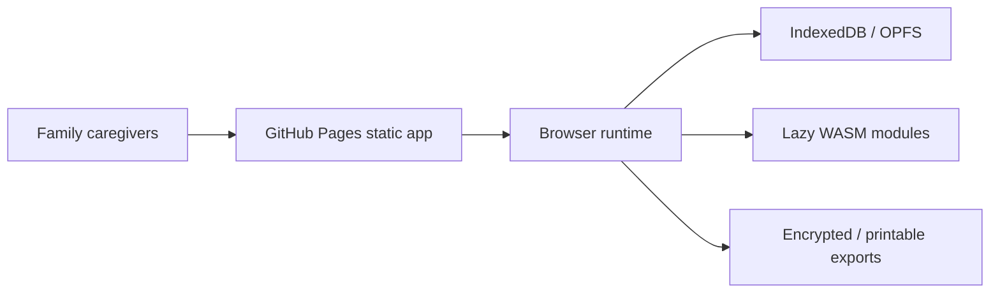

# Elder Care Coordinator


Live site: https://baditaflorin.github.io/elder-care-coordinator/

Repository: https://github.com/baditaflorin/elder-care-coordinator

Elder Care Coordinator is a local-first GitHub Pages app for families coordinating medications, appointments, insurance correspondence, and emergency packets without moving private care data to a hosted backend.

Phase 3 makes the app usable with real data: paste, upload, drag-drop, or read clipboard text/HTML/CSV/Markdown/JSON care artifacts; review confidence-scored candidates; then export, import, copy, print, or encrypt the resulting workspace and packet.

## Verified Features

- Text, HTML, CSV, Markdown, JSON, multi-file, drag-drop, clipboard, sample, and small hash-link artifact intake.
- Medication, appointment, task, note, correspondence, and emergency-packet workflows stored locally in IndexedDB/Yjs.
- Versioned workspace JSON export/import round-trip.
- Markdown, HTML, encrypted age packet, copy-to-clipboard, and print outputs.
- Browser settings for candidate auto-selection, default caregiver, and packet provenance.

## Limitations

- No hosted backend, accounts, server sync, or direct private portal URL fetching.
- No OCR/photo/scanned-PDF parsing yet; extract text first and upload or paste it.
- Optional Pandoc, Whisper, and local LLM actions fetch pinned public ESM modules after explicit user action.


## Quickstart

```bash
npm install
make install-hooks
make dev
make build
make smoke
```

## Architecture



## Links

Live site: https://baditaflorin.github.io/elder-care-coordinator/

GitHub repository: https://github.com/baditaflorin/elder-care-coordinator

Support via PayPal: https://www.paypal.com/paypalme/florinbadita

Architecture docs: https://github.com/baditaflorin/elder-care-coordinator/tree/main/docs

ADRs: https://github.com/baditaflorin/elder-care-coordinator/tree/main/docs/adr

Privacy: https://github.com/baditaflorin/elder-care-coordinator/blob/main/docs/privacy.md

Phase 2 substance postmortem: https://github.com/baditaflorin/elder-care-coordinator/blob/main/docs/postmortem-phase2-substance.md

Phase 3 completeness postmortem: https://github.com/baditaflorin/elder-care-coordinator/blob/main/docs/postmortem-phase3.md
