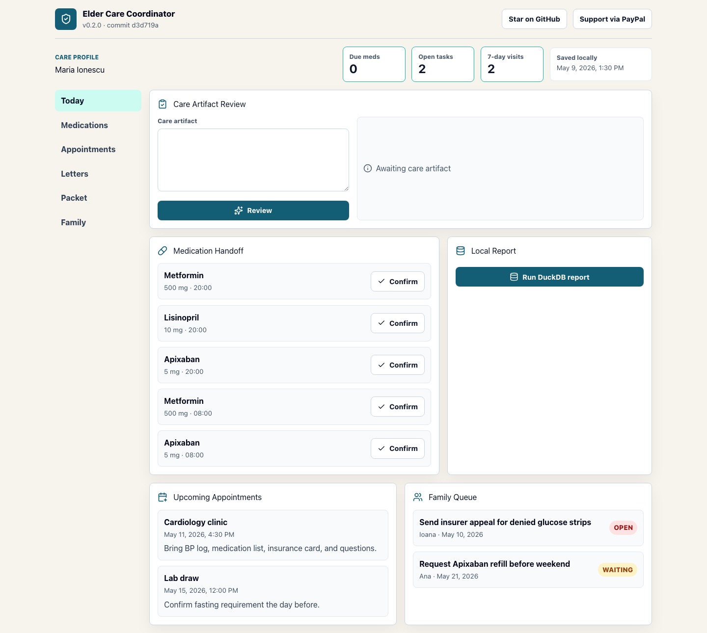
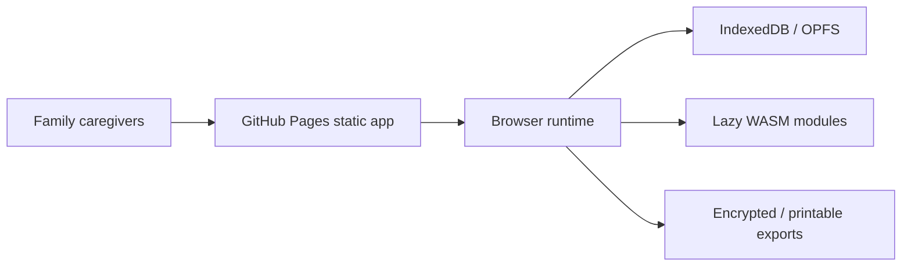

# Elder Care Coordinator


Live site: https://baditaflorin.github.io/elder-care-coordinator/

Repository: https://github.com/baditaflorin/elder-care-coordinator

Elder Care Coordinator is a local-first GitHub Pages app for families coordinating medications, appointments, insurance correspondence, and emergency packets without moving private care data to a hosted backend.

Phase 2 adds a deterministic care-artifact review engine: paste messy medication lists, prescription sigs, insurance denials, appointment reminders, or family chats and get confidence-scored candidates the family can apply or correct.



## Quickstart

```bash
npm install
make install-hooks
make dev
make build
make smoke
```

## Architecture



## Links

Live site: https://baditaflorin.github.io/elder-care-coordinator/

GitHub repository: https://github.com/baditaflorin/elder-care-coordinator

Support via PayPal: https://www.paypal.com/paypalme/florinbadita

Architecture docs: https://github.com/baditaflorin/elder-care-coordinator/tree/main/docs

ADRs: https://github.com/baditaflorin/elder-care-coordinator/tree/main/docs/adr

Privacy: https://github.com/baditaflorin/elder-care-coordinator/blob/main/docs/privacy.md

Phase 2 substance postmortem: https://github.com/baditaflorin/elder-care-coordinator/blob/main/docs/postmortem-phase2-substance.md
