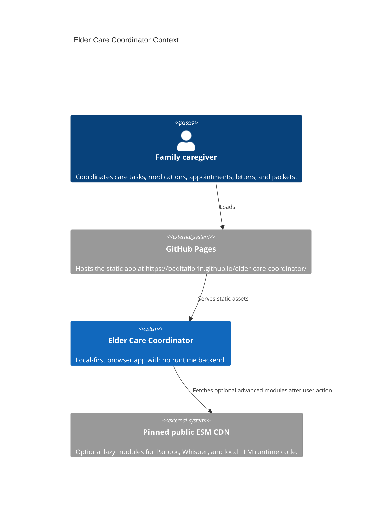
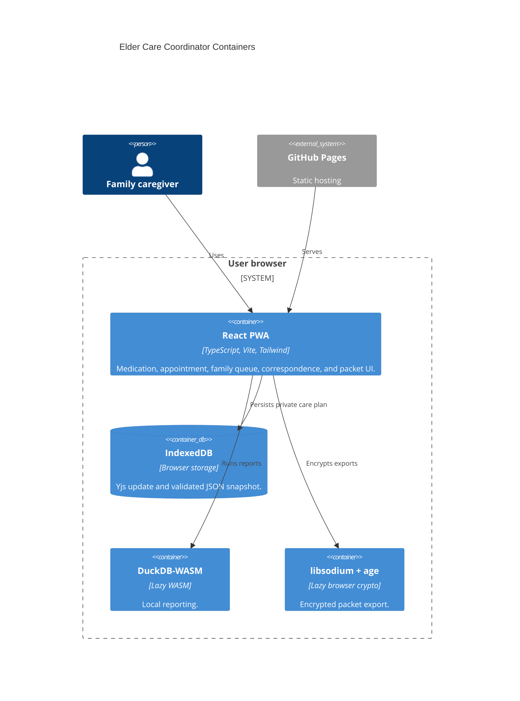

# Architecture

## Context

## Container

## Boundaries

Private care data stays inside the browser unless the user downloads or imports a file. There is no project-owned backend, server log, authentication system, or hosted care database in v1.

Live app: https://baditaflorin.github.io/elder-care-coordinator/

Repository: https://github.com/baditaflorin/elder-care-coordinator
